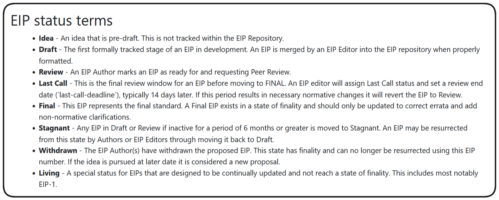

# ERC20 Crypto Currency

We are going to develop an ERC20 Crypto Currency. You will:

1. learn the fundamentals of ERC20
2. manually create your own token
3. explore the OpenZeppelin
4. deploy your new ERC20 token
5. test your token using AI

## ERC20 Basics

In this section we're going to be diving into `ERC20s`, and how to develop, deploy and test them.

### ERCs and EIPs

The Web3 and blockchain ecosystem is fundamentally democratic and open source. As such major blockchains will often implement methods by which the community can submit suggestions for changes in methodologies and standards. These are typically known is `Improvement Proposals`, and in the Ethereum ecosystem they are `Ethereum Improvement proposals` (`EIPs`).

If `EIPs` get enough traction to warrant genuine consideration they will often generate a `Request for Comments`, in Ethereum these are known as `Ethereum Request for Comments` (`ERCs`).

> ❗ **NOTE** > `EIPs` and `ERCs` are numbered chronologically! `ERC20` is the 20th request for comments that was created.

New `Improvement Proposals` and `Requests for Comments` are tracked on websites such as **[eips.ethereum.org](https://eips.ethereum.org/)**, where you can watch these proposals go through the process real time and be adopted or rejected by the community.



### EIP status terms

* **Idea** - An idea that is pre-draft. This is not tracked within the EIP Repository.
* **Draft** - The first formally tracked stage of an EIP in development. An EIP is merged by an EIP Editor into the EIP repository when properly formatted.
* **Review** - An EIP Author marks an EIP as ready for and requesting Peer Review.
* **Last Call** - This is the final review window for an EIP before moving to FINAL. An EIP editor will assign Last Call status and set a review end date (`last-call-deadline`), typically 14 days later. If this period results in necessary normative changes it will revert the EIP to Review.
* **Final** - This EIP represents the final standard. A Final EIP exists in a state of finality and should only be updated to correct errata and add non-normative clarifications.
* **Stagnant** - Any EIP in Draft or Review if inactive for a period of 6 months or greater is moved to Stagnant. An EIP may be resurrected from this state by Authors or EIP Editors through moving it back to Draft.
* **Withdrawn** - The EIP Author(s) have withdrawn the proposed EIP. This state has finality and can no longer be resurrected using this EIP number. If the idea is pursued at a later date it is considered a new proposal.
* **Living** - A special status for EIPs that are designed to be continually updated and not reach a state of finality. This includes most notably EIP-1.

### ERC20

One of the most recognized `Ethereum Requests for Comments` is the **[ERC20 Token Standard](https://eips.ethereum.org/EIPS/eip-20)**. This is a proposal in which the methodology for creating and managing these tokens on the Ethereum blockchain was tabled.

These tokens essentially exists as records of value within smart contracts on chain and this smart contract tracking of balances is a very powerful thing in Web3.

_**Why make an ERC20?**_

There are a few common reasons that someone may choose to launch an `ERC20 token`, but there's very little limit to the possibilities of their application in a digital space. A few common use cases include:

* Governance Tokens
* Securing an underlying network
* Synthetic Assets
* Stable Coins

...and more.

_**How do I build an ERC20?**_

All anyone has to do to develop and `ERC20` is to deploy a smart contract which follows the **[token standard](https://eips.ethereum.org/EIPS/eip-20)**. This ultimate boils down to assuring our contract includes a number of necessary functions: `transfer`, `approve`, `name`, `symbol`, `balanceOf` etc.

## Creating an ERC20

set up the foundry project environment using `forge init` command.

You can begin by creating a new token our `src` directory named `ManualToken.sol`. We can start this contract the same way we've been practicing this whole time.

```solidity
// SPDX-License-Identifier: MIT
pragma solidity ^0.8.18;

contract ManualToken {}
```

All we need to do to make our token compatible is follow the **[ERC20 Token Standard](https://eips.ethereum.org/EIPS/eip-20)**. Essentially this means we need to include the required functions/methods for our deployment to follow this standard. Let's add thing functionality then!

Let's start with name, decimals and totalSupply

```solidity
// SPDX-License-Identifier: MIT
pragma solidity ^0.8.18;

contract ManualToken {

    function name() public pure returns(string memory) {
        return "Manual Token";
    }

    function totalSupply() public pure returns (uint256) {
        return 100 ether; // 100000000000000000000
    }

    function decimals() public pure returns (uint8) {
        return 18;
    }
}
```

> ❗ **NOTE**
> Despite being an optional method, we're including `decimals` here as a point of clarification since we're declaring our total supply as 100 ether. 100 ether = 100 + 18 decimals places.

The next functions required by the ERC20 standard are `balanceOf` and `transfer`.

```solidity
// SPDX-License-Identifier: MIT
pragma solidity ^0.8.18;

contract ManualToken {

    function name() public pure returns(string memory) {
        return "Manual Token";
    }

    function totalSupply() public pure returns (uint256){
        return 100 ether; // 100000000000000000000
    }

    function decimals() public pure returns (uint8) {
        return 18;
    }

    function balanceOf(address _owner) public pure returns (uint256){
        return // ???
    }
}
```

What is this function meant to return exactly? We're going to need a mapping to track the balances of each address...

```solidity
mapping(address => uint256) private s_balances;
```

So now our `balanceOf` function can return this mapped value based on the address parameter being passed.

```solidity
function balanceOf(address _owner) public pure returns (uint256) {
   return s_balances[_owner];
}
```

An interesting thing that comes to light from this function is - someone's balance of a token is really just some mapping on a smart contract that says `this number is associated with this address` That's it. All swaps, transfers and trades are represented as an updating to the balance of this mapping.

> ❗ **PROTIP**
> Our name function could also be represented by a public declaration such as `string public name = "ManualToken";`. This is because Solidity creates public getter functions when compiled for any publicly accessible storage variables!

Our next required function is transfer:

```solidity
function transfer(address _to, uint256 _amount) public {
    uint256 previousBalance = balanceOf(msg.sender) + balanceOf(_to);
    s_balances[msg.sender] -= _amount;
    s_balances[_to] = _amount;

    require(balanceOf(msg.sender) + balanceOf(_to) == previousBalance);
}
```

So, a basic transfer function could look something like the above, a simple adjustment of the balances mapped to both the sender and receiver addresses in our contract.

## ERC20 OpenZeppelin

Let's using the OpenZeppelin Library to achieve pre-deployed, audited, and ready-to-go contracts to build our ERC20 token.

> ❗ **NOTE**
> OpenZeppelin is renowned for its Smart Contract framework, offering a vast repository of audited contracts readily integrable into your codebase.

Access [OpenZeppelin's documentation](https://docs.openzeppelin.com/contracts/5.x/) via their official website. By navigating to [Products -> Contracts Library](https://www.openzeppelin.com/contracts), you can discover a vast array of ready-to-use contracts.

Additionally, OpenZeppelin offers a contract wizard, streamlining the contract creation process — perfect for tokens, governances, or custom contracts.


Let's leverage OpenZeppelin to create a new ERC20 Token. Create a new file within `src` named `MyToken.sol`. Once that's done, let's install the OpenZeppelin library into our contract.

```bash
forge install OpenZeppelin/openzeppelin-contracts --no-commit
```

Once installed you'll see the ERC20 contract from OpenZeppelin within `lib/openzeppelin-contracts/token/ERC20/ERC20.sol`. Let's add a remapping in our foundry.toml to make importing a little easier on us.Within foundry.toml add the line:

```toml
remappings = ["@openzeppelin=lib/openzeppelin-contracts"]
```

We can now import and inherit this contract into `MyToken.sol`!

```solidity
// SPDX-License-Identifier: MIT
pragma solidity ^0.8.18;

import {ERC20} from "@openzeppelin/contracts/token/ERC20/ERC20.sol";

contract MyToken is ERC20 {
    //constructor goes here
}
```

By importing the OpenZeppelin implementation of ERC20 this way, we inherit all the functionality of the ERC20 standard with much less work and a level of confidence that the code has been testing and verified.

> ❗ **PROTIP**
> If you're looking for an alternative library full of trusted contracts, I recommend looking at the **[Solmate Repo](https://github.com/transmissions11/solmate)** by Transmissions11.

Now, we should recall that when inheriting from a contract with a constructor, our contract must fulfill the requirements of that constructor. We'll need to define details like a name and symbol for MyToken.

```solidity
// SPDX-License-Identifier: MIT
pragma solidity ^0.8.18;

import {ERC20} from "@openzeppelin/contracts/token/ERC20/ERC20.sol";

contract MyToken is ERC20 {
    constructor(uint256 initialSupply) ERC20("MyToken", "OT") {
        _mint(msg.sender, initialSupply);
    }
}
```

For the purposes of simple examples like this, I like to mint the initialSupply to the deployer/msg.sender, which I've demonstrated above.

As always we can perform a sanity check to assure things are working as expected by running `forge build`.

### ERC20 Deploy Script

With our simple token contract written, we'll of course want to test and deploy it. Let's get started with writing a deploy script.

In your workspace's `script` folder, create a file named `DeployMyToken.s.sol`.

We expect MyToken to behave the same, regardless of the chain it's deployed on, so we don't really need a `HelperConfig` for this example. We'll skip that step and move write into writing the deploy script.

To begin, we can import Script and MyToken as well as add the skeleton of our run function:

```solidity
// SPDX-License-Identifier: MIT

pragma solidity ^0.8.18;

import {Script} from "forge-std/Script.sol";
import {MyToken} from "../src/MyToken.sol";

contract DeployMyToken is Script {
    function run() external {}
}
```

We're going to keep this really basic, we just want to deploy MyToken. We know that MyToken requires an initial supply as a constructor parameter, so let's declare that and then deploy our contract.

```solidity
// SPDX-License-Identifier: MIT

pragma solidity ^0.8.18;

import {Script} from "forge-std/Script.sol";
import {MyToken} from "../src/MyToken.sol";

contract DeployMyToken is Script {
    uint256 public constant INITIAL_SUPPLY = 1000 ether;

    function run() external returns (MyToken) {
        vm.startBroadcast();
        MyToken ot = new MyToken(INITIAL_SUPPLY);
        vm.stopBroadcast();

        return ot;
    }
}

```

run `anvil` in a new terminal window and then and then run:
```bash
@forge script script/DeployMyToken.s.sol:DeployMyToken --rpc-url http://localhost:8545 --private-key $(DEFAULT_ANVIL_KEY) --broadcast
```